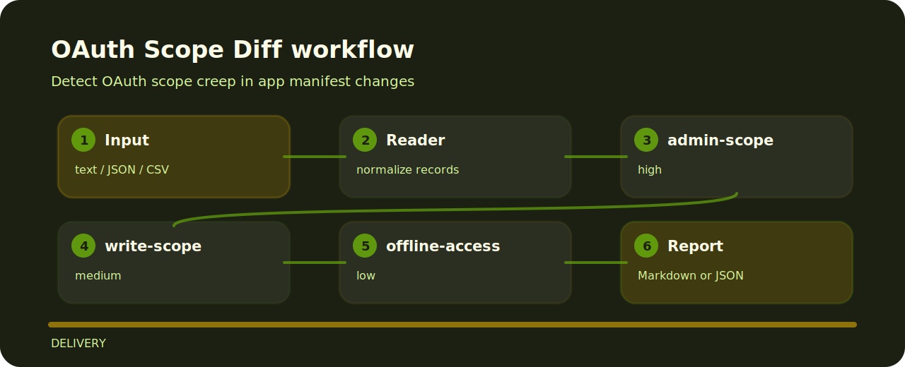

# OAuth Scope Diff

| Field | Value |
| --- | --- |
| Area | delivery |
| Command | `oauth-scope-diff` |
| Example | `examples/sample.txt` |


OAuth Scope Diff is meant for quick pull-request checks around OAuth scopes. It favors explicit rules over a bulky dashboard.

## Signals

- `admin-scope` - administrative scope requested (high); Require security review and explicit business justification..
- `write-scope` - write scope requested (medium); Confirm least privilege and limit the token audience..
- `offline-access` - long-lived access requested (low); Document refresh-token storage and rotation controls..

## Finding map



## One-pass run

```bash
git clone https://github.com/mertefekurt/oauth-scope-diff.git
cd oauth-scope-diff
python -m pip install -e ".[dev]"
oauth-scope-diff examples/sample.txt
```
